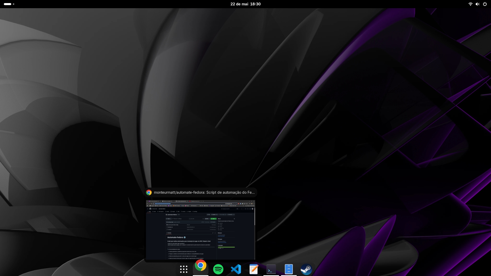
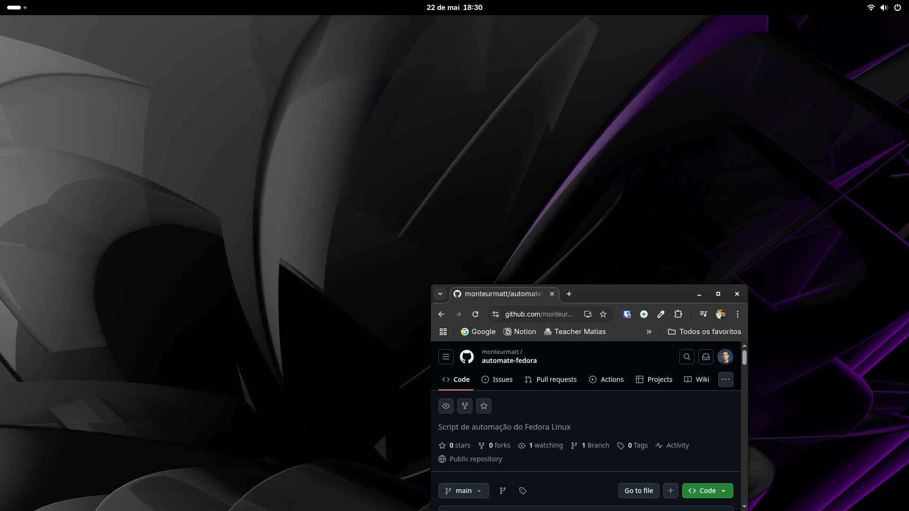
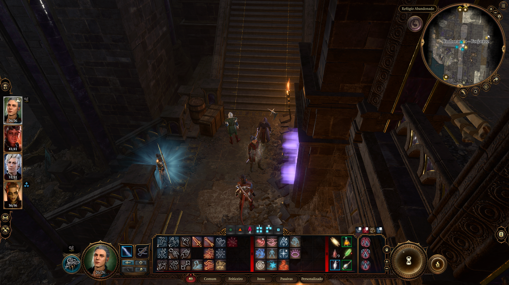
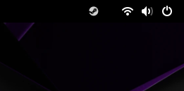

# Automate-Fedora ⚙️
### Script que realiza automações para instalação de apps via DNF, Flatpak e Gext  

*`install.sh` para baixar apps necessários*  
*`/dash-to-panel-matt-configs` para configurar a extensão dash-to-panel de forma manual ou automática*  

---

🔧 Funcionalidades do script
- Instala aplicativos e utilitários populares essenciais no dia a dia

- Prepara o sistema com ferramentas para melhorar a compatibilidade com jogos

- Adiciona extensão para abrir o menu de apps com a tecla Super

- Adiciona área de ícones para mostrar apps em segundo plano na barra superior

- Adiciona barra inferior com menu, favoritos centralizados e ocultação automática  

<br>

### Menu com apps baixados após execução do script:  
  

<br>

### Pré-visualização ao passar o mouse (extensão):  
  

<br>

### Barra se esconde ao ser sobreposta (extensão):  
  

<br>

### Baldur's gate 3 rodando no Fedora 42 com GE-Proton10-3 + Vulkan:  
  

<br>

### Ícones de apps em segundo plano (extensão):  
  

<br>

---

### 📋 Lista de aplicativos com as descrições curtas para ajudar na identificação:  

---

### 🎮 Games & Runners

| Aplicativo                    | Descrição                                                                 |
|------------------------------|---------------------------------------------------------------------------|
| `ProtonPlus`                 | Interface gráfica para gerenciar e instalar versões do Proton personalizadas.|
| `ProtonUp-Qt`                | Gerenciador gráfico para instalar Proton GE, Wine GE e similares.         |
| `steam-rom-manager`          | Adiciona ROMs de consoles à Steam com arte personalizada.                 |
| `SGDBoop`                    | Aplica imagens personalizadas da SteamGridDB à sua biblioteca Steam.      |
| `Bottles`                    | Gerenciador de ambientes Wine para rodar apps e jogos de Windows no Linux.|
| `HeroicGamesLauncher`        | Launcher alternativo para Epic Games Store e GOG.                         |
| `Sunshine`                   | Host para streaming de jogos via Moonlight (como NVIDIA GameStream).      |
| `Lutris`                     | Plataforma que gerencia jogos de várias fontes (Steam, Windows, emuladores)|

---

### 🧰 Utilitários & Sistema

| Aplicativo                    | Descrição                                                                 |
|------------------------------|---------------------------------------------------------------------------|
| `ExtensionManager`           | Interface gráfica para gerenciar extensões do GNOME.                      |
| `Flatseal`                   | Gerenciador de permissões de apps Flatpak.                                |
| `LibreMenuEditor`            | Editor de menus de aplicativos do sistema.                                |
| `Fragments`                  | Cliente de torrent simples e moderno.                                     |
| `Boxes`                      | Aplicativo de máquinas virtuais do GNOME.                                 |
| `LocalSend`                  | Envia arquivos entre dispositivos na mesma rede local.                    |
| `ranger`                     | Gerenciador de arquivos no terminal com navegação em árvore.              |
| `speedtest-cli`              | Ferramenta de linha de comando para testar a velocidade da internet.      |
| `btop`                       | Monitor de sistema interativo com visual moderno no terminal.             |
| `gnome-tweaks`               | Ferramenta para ajustar configurações avançadas do GNOME.                 |
| `gnome-extensions-cli`       | Gerencia extensões do GNOME via terminal.                                 |
| `start-overlay-in-application-view` | Extensão para transformar tecla Super de workspaces para menu de apps.|
| `msttcore-fonts-installer`   | Instala fontes TrueType da Microsoft (como Arial e Times).                |
| `Google Chrome`              | Navegador web popular do Google                                           |

---

### 🎨 Edição de Imagema

| Aplicativo                    | Descrição                                                                 |
|------------------------------|---------------------------------------------------------------------------|
| `GIMP`                       | Editor de imagens avançado, similar ao Photoshop.                         |
| `Krita`                      | Aplicativo para pintura digital e ilustração.                             |

---

### 📺 Mídia

| Aplicativo                    | Descrição                                                                 |
|------------------------------|---------------------------------------------------------------------------|
| `Celluloid`                  | Reprodutor de vídeo baseado em MPV.                                       |
| `TubeConverter`              | Baixa vídeos ou áudios do YouTube e similares.                            |
| `OBS Studio`                 | Gravação de tela e transmissões ao vivo.                                  |
| `Spotify`                    | Cliente de música via streaming.                                          |
| `Discord`                    | Chat de voz/texto para comunidades e jogos.                               |

---

### 💻 Desenvolvimento

| Aplicativo                    | Descrição                                                                 |
|------------------------------|---------------------------------------------------------------------------|
| `Visual Studio Code`         | Editor de código (para desenvolvimento em geral).                         |
| `Docker`                     | Plataforma para criação e gerenciamento de containers.                    |
| `Docker Compose`             | Ferramenta para definir e gerenciar multi-containers com Docker.          |

---

### 📌 Observações

A maioria os aplicativos listados acima foram instalados via Flathub:  
```bash
flatpak install flathub <nome-do-aplicativo>
```

### 🎮 Rodar jogos da Steam (Windows) no Linux:
Para jogar títulos da Steam disponíveis apenas para Windows (ou macOS) no Linux, use o ProtonUp-Qt ou ProtonPlus para baixar o GE-Proton na versão mais atual (recomandado)  
Depois, na Steam, vá até o jogo desejado → clique na engrenagem → Propriedades → Compatibilidade → marque a opção para forçar compatibilidade e escolha o GE-Proton instalado.


